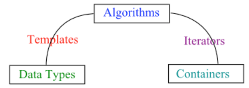

# Polymorphism

_Slides:_

- _[13 Polymorphism](13-Polymorphism.pdf)_
- _[14 C++ templates](14-C++-templates.pdf)_
- _[15 Java Generics](15-Java-Generics.pdf)_
- _[16 C++ Standard Template Library](16-C++-Standard-Template-Library.pdf)_

Polymorphism = "several forms"

## Binding time
The binding of the function name with the code can be:

- at compile time (early, static binding: better, for debugging reasons)
- at linking time
- at execution time (late, dynamic binding)

## Classification of polymorphism


### Universal vs ad hoc polymorphism
- ad hoc: same functions name denotes different implementations, determined by the actual type
- universal: one implementation suitable for different objects

Universal and ad-hoc polymorphis can coexist.

### Overloading (ad hoc)
- Present in all languages, at least for arithmetics operators (+, -, ...), sometimes available also on user-defined functions.
- Early binding in statically typed languages, late binding in dynamically typed ones.

### Coercion (universal)
The automatic conversion of an object to a different type. Opposed to casting, which is explicit.

### Inclusion (universal)
Subtyping, inheritance.  
Is ensured by the _substitution principle_: an object of a subtype (subclass) can be used in any context where an object of the supertype (superclass) is expected.  
It is usually resolved a compile type (static binding).

### Overriding (ad hoc in universal)
Overriding of a method in a subclass (thus it is possible only with inclusion).  
Changes the signature: parameters and return value maintain the same type, but changes the type of the object on which it can be invoked on.  
It is resolved at runtime (dynamic binding) with invokevirtual.

### Parametric (universal)
- Generics in Java (explicit, bounded)
- Function Templates in C++ (explicit)

#### Function Templates in C++
```
template <class T> // or <typename T>
T sqr(T x) { return x * x; }
```
Compiler/linker automatically generates one version for each parameter type used by a program:
```
int a = sqr(5);        // generates int sqr(int x) { return x * x; }
double b = sqr(3.14);  // generates double sqr(double x) { return x * x; }
```
Templates are executed by the compiler and differs from the macros that are executed by the preprocessor. Macros are just textually substituted, on templates are performed analysis checks.

Instantiation at compile time (static binding).

#### Generics in Java
`Array<Type1>` and `Array<Type2>` are not related by subtyping, but `Type1[]` and `Type2[]` are. Thus Java arrays are covariant.

### Invariance, Covariance and contravariance
- Invariant: don't depend on type hierarchy.
- Covariant: preserve the type hierarchy (safe if the type is read-only).
- Contravariant: invert the type hierarchy (safe if the type is write-only).

#### PECS Principle
Producer Extends, Consumer Super:

- Covariance: `? extends T`, to get values from a producer.
- Contravariance: `? super T` to insert valued in a consumer.

Example:
```
<T> void copy(List< ? super T > dst, List< ? extends T > src);
```

## Standard Template Library (C++)
The **goal** of the STL is to represent algorithms in as general form as possible without compromising efficiency.

### Main entities
- Container: collection of typed objects.
- Algorithm: initialization, sorting, searching and transforming of containers' contents.
- Iterator: generalization of pointer address, used for decoupling algorithms from containers.
- Template: make algorithms indipendent from data-types.
- Adaptor: conert from one form to another.
- Function object: form of closure.
- Allocator: encapsulation of a memory pool.



### C++ namespaces
STL relies on C++ namespaces: containers exposes a type named iterator in the container's namespace.  
Each class implicity introduces a new namespace, the iterator type assumes its meaning depending on the context.

### Complexity
Insert/delete complexity in containers:

| Container | Beginning |  Middle  |    End   |
|:---------:|:---------:|:--------:|:--------:|
|   vector  |   linear  |  linear  | constant |
|    list   |  constant | constant | constant |
|   deque   |  constant |  linear  | constant |

### Iterator types
Iterators implements operations in constant time.  
Containers may support different operators depending on their structure.

- Forward iterators: dereference (operator\*) and pre/post increment operators (++operator/operator++).
- Input and output iterators: forward iterators with possible issues in deferencing the the iterator due to I/O operations.
- Bidirectional iterators: forward iterators with pre/post decrement operators (--operator/operator--).
- Random access iterator: bidirectional iterators with integer sum and difference (operator+n/operator-n)

| Container |    Iterator   |
|:---------:|:-------------:|
|   vector  | random access |
|    list   | bidirectional |
|   deque   | random access |

When a container is modified iterators to it can become invalid: the result of operations on  them is not defined.

### Memory model
STL abstract the memory model with _allocators_. Allocators are classes that incapsulate the information about the memory model. Each container is parametrized by such an allocator to let the implementation unchanged when switching memory models.

### Limitations
- Iterators provides a linear view of a container, so can be defined only algorithm operating on single-dimention containers.
- Iterators keep information about the state of the visit: the complexity of the state grow with the complexity of the container.
- Lack of error checking with STL.
- All facilities of the compiler fails with STL.
